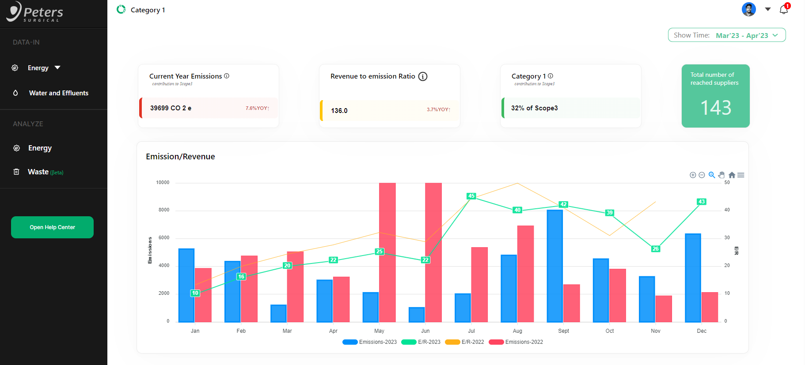
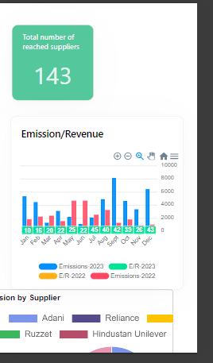

# Peter Surgical

A React.js dashboard for reviewing and checking different types of energies emitted and revenue used for any particular year


## Features

- Filter between different years.
- Check emissions for different years.
- Check emission by suppliers.


## Run Locally

Clone the project

```bash
  git clone https://github.com/AbhishekGupta1212/PeterSurgical.git
```


Run Locally after Clone

```bash
  npm start
```
<h2>
  Live Link 
<a href='https://petersurgicaldb.vercel.app'/>Peter Surgical<a>
</h2>


## Tech Stack
- HTML
- CSS
- React.js
- Redux
- Chakra UI
- Chart.js


## Screenshots

<h2>Home Page</h2>


<h2>Pie and Table</h2>

<h2>Chart with different Year </h2>\

<h2>Mobile View</h2>

